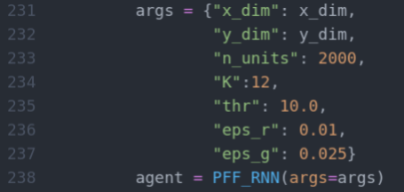

# <p align="center">The Predictive Forward-Forward Algorithm</p>
## <p align="center">Bio-plausible Forward-Only Learning for Training Neural Networks</p>
Implementation of the proposed predictive forward-forward (PFF) learning algorithm for training
a neurobiologically-plausible recurrent neural system. This work combines elements of predictive coding with the recently proposed forward-forward algorithm to create a novel online learning process that involves dynamically adapting two neural circuits - a representation circuit and a generative circuit. Notably, the system introduces noise injection into the latent activity updates as well as learnable lateral  synapses that induce competition across neural units (emulating cross-inhibitory and self-excitation
effects inherent to neural computation).

# Requirements
Our implementation is easy to follow and, with knowledge of basic linear algebra, one can decode the inner workings of the PFF algorithm. Please look at Algorithm-1 in our paper to better understand the overall mechanics of the inference and learning processes. In this framework, we have provided simple modules; thus hopefully making it very convenient to extend our framework.

To run the code, you should only need following basic packages:
1. TensorFlow (version >= 2.0)
2. Numpy
3. Matplotlib
4. Python (version >=3.5)
5. [ngc-learn](https://github.com/ago109/ngc-learn) (Some modules responsible for generating image samples are dependent on <i>ngc-learn</i> -- if you do not install ngc-learn, you won't be able to use `fit_gmm.py`, as this script uses the mixture model
in that package to retro-fit the latent prior for the PFF model's generative circuit, which means that `sample_model.py`
and `plot_tsne.py` will have no prior distribution model to access, so simply comment out the lines that
involve `sample_model.py` and `plot_tsne.py` in the `analyze.sh` script if you do not install ngc-learn).

# Execution

To reproduce results from our paper, simply perform the following steps (running the relevant provided Bash scripts) the following provided Bash scripts:
1. `bash src/run.sh` (This will train model for `E=60` epochs.)
2. `bash src/analyze.sh` (This will evaluate a trained model and produce plots/visuals.)
After running the above two scripts, you can find the simulation outputs in the example
experimental results directory tree that have been pre-created for you.
`exp/pff/mnist/` contains the results for the MNIST model (over 2 trials) and
`exp/pff/kmnist/` contains the results for the KMNIST model (over 2 trials).
In each directory, the following is stored:
* `post_train_results.txt` - contains development/training cross-trial accuracy values
* `test_results.txt` - contains test cross-trial accuracy values
* `trial0/` - contains model data for trial 0, as well as any visuals produced by `analyze.sh`
* `trial1` - contains model data for trial 1, as well as any visuals produced by `analyze.sh`
(Note that you should modify the `MODEL_DIR` in `analyze.sh` to point to a particular
trial's sub-directory -- the default points to trial 0, and thus only places images
inside of the `trial0/` sub-directoy. )

Model-specific hyper-parameter defaults can be set/adjusted in `pff_rnn.py`.
Training-specific hyper-parameters are available in `sim_train.py` - note that one
can create/edit an arguments dictionary much like the one depicted below (inside of `sim_train.py`):



which the `PFF_RNN()` constructor takes in as input to construct the simulation of
the dual-circuit system.

Tips while using this algorithm/model on your own datasets:
1. Track your local losses, accordingly adjust the hyper-parameters for the model
2. Play with non-zero, small values for the weight decay coefficients `reg_lambda` (for
   the representation circuit) and `g_reg_lambda` (for the generative circuit) - for
   K-MNIST a small value (as indicated in the comments) for `reg_lambda` seemed to
   improve generalization performance slightly in our experience.

# Citation

If you use or adapt (portions of) this code/algorithm in any form in your project(s), or
find the PFF algorithm helpful in your own work, please cite this code's source paper:

```bibtex
@article{ororbia2023predictive,
  title={The Predictive Forward-Forward Algorithm},
  author={Ororbia, Alexander and Mali, Ankur},
  journal={arXiv preprint arXiv:2301.01452},
  year={2023}
}
```
